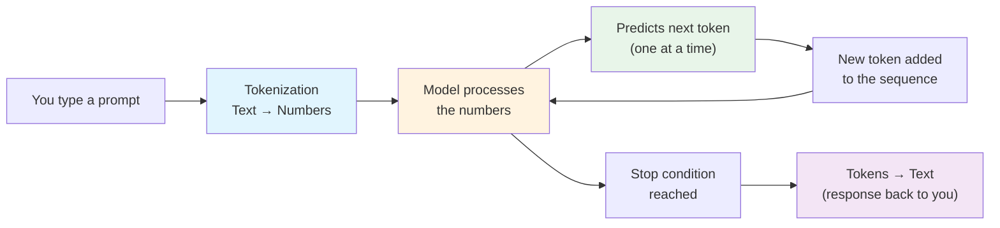
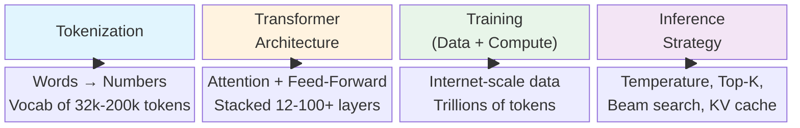
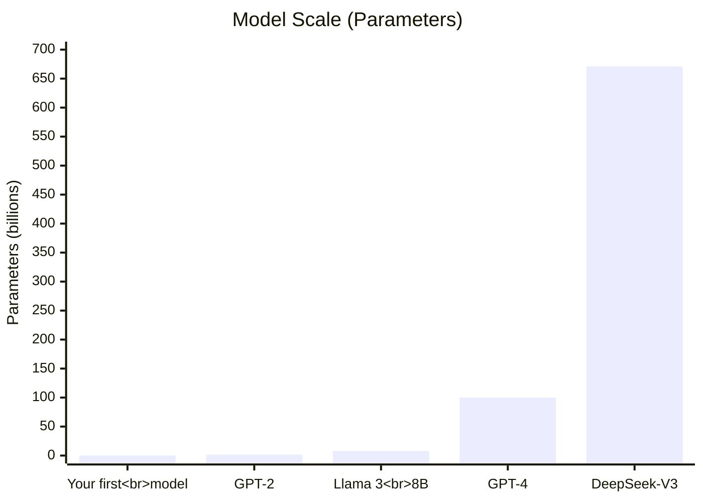

# Chapter 00: How LLMs Work

> **Audience**: 🟢 All roles
> **Prerequisites**: None
> **Estimated time**: 10 minutes read, 0 minutes code

---

## The One-Sentence Summary

**An LLM is an advanced autocomplete.** You give it text, it predicts the next most likely word (or token), feeds that prediction back in, and repeats until it has a complete response.

That's it. Everything else — attention, transformers, training, billions of parameters — is engineering that makes that autocomplete shockingly good.

---

## The High-Level Flow

### Step-by-Step

1. **Tokenization**: Your sentence is chopped into smaller pieces (tokens) and converted to numbers.
2. **Processing**: Those number-arrays flow through the model — a giant series of mathematical operations.
3. **Prediction**: The model outputs probabilities for every possible next token. It picks one (with some randomness).
4. **Loop**: That predicted token is appended to the input, and steps 2–3 repeat.
5. **Stop**: When the model predicts a "stop" token or hits a length limit, it outputs the final text.

---

## The Four Magic Ingredients

### 1. Tokenization
The model doesn't see letters or words — it sees **token IDs**. "Hello world" might become `[15496, 995]`. Each number maps to a row in a giant lookup table (the vocabulary).

### 2. Architecture (Transformer)
This is the model itself — a stack of layers. Each layer has two parts:
- **Self-Attention**: Figures out which tokens are related to which. "The cat sat on the *mat*" — attention helps the model connect "mat" to "cat" even though they're far apart.
- **Feed-Forward Network**: Processes each token's information independently.

### 3. Training
The model is trained by showing it trillions of tokens from the internet, books, code — and asking it to predict the next token. Every time it's wrong, it adjusts its internal parameters (weights) slightly. After enough repetitions, the weights encode patterns of language.

### 4. Inference Strategy
When generating, we control how the model picks tokens:
- **Temperature**: Higher = more creative/random; lower = more focused/deterministic.
- **Top-K**: Only consider the K most likely tokens at each step.
- **KV Cache**: Stores previously computed values so generation doesn't recompute everything from scratch.

---

## Size Comparison

Don't be intimidated. We'll start with a model smaller than 5 million parameters (fits on a laptop), understand every line, and then you'll see how the same principles scale to models 10,000x larger.

---

## 🟢 Key Takeaways for Everyone

- **An LLM is an autocomplete engine** — it predicts the next token, one at a time.
- **It knows nothing.** It doesn't "understand" language in a human sense. It has learned statistical patterns from training data.
- **Training is expensive** (millions of dollars for frontier models). **Inference is cheap** (pennies per query).
- **The four ingredients** are: Tokenization → Architecture → Training → Inference Strategy.
- **Everything in this curriculum** builds toward understanding the second ingredient — the Transformer architecture — in full detail.

---

## 🟢 Check Your Understanding

Test yourself before moving to the next chapter.

1. **What is the fundamental task an LLM is trained to do?**

    

    
Show answer

    Predict the next token given the previous tokens. Everything else (answering questions, writing code, summarizing) emerges from this simple next-token prediction task.
    

2. **What are the four ingredients that make an LLM work?**

    

    
Show answer

    1. **Tokenization** — converting text to numbers
    2. **Architecture** — the Transformer (attention + feed-forward layers)
    3. **Training** — learning from trillions of tokens by predicting the next one
    4. **Inference Strategy** — how we sample tokens during generation (temperature, top-k, etc.)
    

3. **Why does the model output probabilities instead of a single token?**

    

    
Show answer

    The model outputs a probability distribution over the entire vocabulary. We then sample from this distribution (using temperature, top-k, etc.) to pick the actual next token. This sampling introduces controlled randomness, making generations feel natural rather than repetitive.
    

4. **What's the difference between training and inference?**

    

    
Show answer

    **Training**: The model sees input + target tokens, computes loss, and updates weights to reduce error. This is slow and expensive (GPU clusters, weeks). **Inference**: The model only sees input tokens, predicts the next token, and generates text. No weights are updated. This is fast and cheap (single GPU, milliseconds).
    

---

## Terms Introduced

| Term | Quick Definition |
|------|------------------|
| **Token** | A unit of text (word fragment), represented as an integer ID |
| **Parameter** | A learnable weight inside the model (one tiny knob among billions) |
| **Attention** | The mechanism that finds relationships between tokens |
| **Temperature** | Controls randomness in token selection during generation |
| **Training** | The process of adjusting parameters to reduce prediction error |
| **Inference** | Using a trained model to generate text |

---

> **Next Chapter**: [Tensors & Matrix Multiply](01-tensors-and-matmul.md) — the math that powers everything.
>
> *If you're on the 🟢 conceptual track: focus on the shapes and intuition.
> If you're on the 🔵 engineer track: open `code/01-tensors/01_tensor_basics.py` and run it alongside.*
