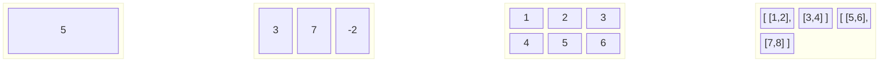
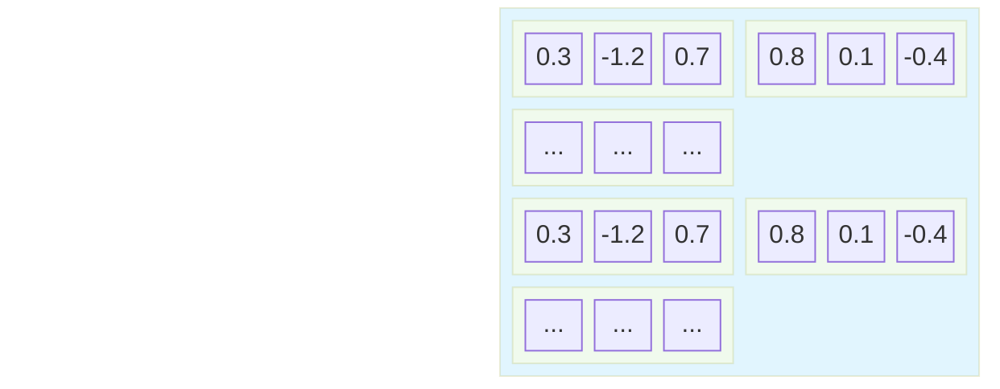
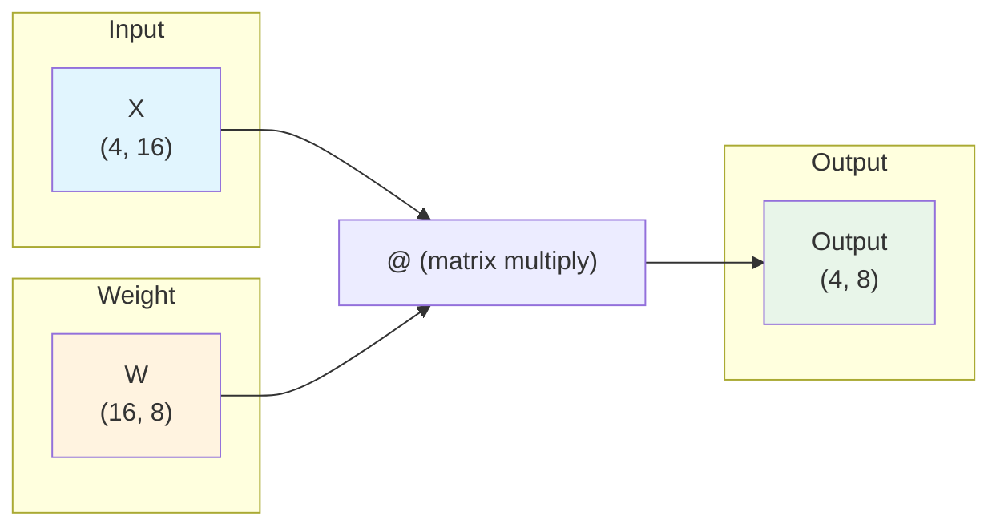
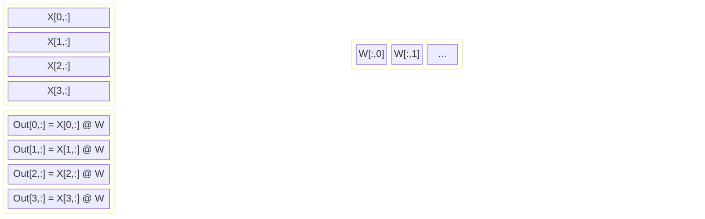

# Chapter 01: Tensors & Matrix Multiply

> **Audience**: 🟢 All roles
> **Prerequisites**: Chapter 00 (How LLMs Work)
> **Estimated time**: 15 minutes read, 15 minutes code (🔵 engineers)

---

## Why This Matters

Everything in a neural network is a **tensor operation**. When someone says "the model has 8 billion parameters," they mean the model contains 8 billion numbers arranged into tensors, multiplied together in specific patterns.

If you understand tensors and the matrix multiply, you understand 80% of what a neural network *actually does*.

---

## What is a Tensor?

A tensor is just a **container of numbers** arranged in a grid. It's a generalization of things you already know:



| Name | Aliases | Dimensions | Shape | In LLM Terms |
|------|---------|------------|-------|-------------|
| **Scalar** | Single number | 0D | `()` | A single loss value |
| **Vector** | 1D array | 1D | `(N,)` | A token embedding |
| **Matrix** | 2D table | 2D | `(R, C)` | A weight matrix |
| **3D Tensor** | Tensor | 3D | `(B, T, C)` | A batch of sequences |

### The Most Important Shape in LLMs: `[B, T, C]`

In nearly every diagram that follows, you'll see this shape notation:

- **B** = **Batch** — how many sequences we process at once (e.g., 4, 32)
- **T** = **Time / Sequence length** — how many tokens in the sequence (e.g., 256, 4096)
- **C** = **Channels / Embedding dimension** — how many numbers represent each token (e.g., 64, 4096)



**Shape**: `[B=2, T=3, C=3]` — 2 sequences, each with 3 tokens, each token represented by 3 numbers.

---

## The Operation That Does Everything: Matrix Multiply

> A neural network, at its core, is a sequence of matrix multiplies.

### What It Does

You have two matrices:

| Matrix | Shape | Meaning |
|--------|-------|---------|
| **Input** X | `(batch, features_in)` | Your data |
| **Weight** W | `(features_in, features_out)` | What the model learns |

The operation: **X @ W** produces output of shape `(batch, features_out)`.



### The Golden Rule of Shapes

> **(A, B) @ (B, C) → (A, C)**

The inner dimensions must match (B = B), and the result takes the outer dimensions (A × C).

### Visual Intuition



Each row of the input is **dotted** with every column of the weight matrix. The result is a new representation where every output element is a weighted mixture of all input elements.

*(In the diagram: `X[0,:]` means "row 0, all columns"; `W[:,0]` means "column 0, all rows" — standard slice notation.)*

### Why This Is All You Need

A linear layer in a neural network is literally just:

> **output = input @ weight.T + bias**
> *(`.T` is the **transpose** — it flips a matrix so rows become columns, needed here because `nn.Linear` stores weights in transposed order internally)*

Where `weight.T` is the weight matrix **transposed** (rows become columns, columns become rows). This is needed because `nn.Linear` stores weights internally in `(out_features, in_features)` order, but matmul requires `(in_features, out_features)`. The transpose swaps the dimensions so the matmul works.

That's it. One matrix multiply, one addition. Stack a few hundred of these with attention and activations between them, and you have a modern LLM.

---

## 🟢 Key Takeaways for Everyone

| Concept | Intuition |
|---------|-----------|
| **Tensor** | A container of numbers, organized by dimensions |
| **Shape** | The size of each dimension: `(rows, columns)` for 2D |
| **Matrix Multiply** | The operation that transforms input using learned weights |
| **[B, T, C]** | The universal shape in LLMs: Batch, Tokens, Channels |
| **Weight** | A learnable matrix that encodes a transformation |

A neural network takes an input tensor, multiplies it by learned weight tensors (with activations in between), and produces an output tensor. **The entire LLM is built on this foundation.**

---

### 🟢 Check Your Understanding

1. **What's the shape of a single token's embedding in an LLM with d_model=512?** → `(512,)` — a 1D tensor with 512 elements.
2. **If you have a batch of 16 sequences, each 128 tokens long, with d_model=512, what's the full input shape?** → `(16, 128, 512)`
3. **When you do `X @ W` and X.shape is (4, 8) and W.shape is (8, 12), what's the output shape?** → `(4, 12)` — the inner dimension 8 must match.
4. **What does `.T` do in PyTorch?** → Transpose: flips rows and columns of a matrix.

> Need help? Re-read the "Golden Rule of Matrix Multiply" section above.

---

## 🔵 For Engineers: Run the Code

Open and run these companion scripts:

```bash
# Step 1: Tensor basics — creating, inspecting, operating
python code/01-tensors/01_tensor_basics.py

# Step 2: Matrix multiply deep dive
python code/01-tensors/02_matrix_multiply.py
```

After running each:
1. Look at every shape printed — verify the golden rule.
2. Change a shape (e.g., make the input wider) and observe what breaks.
3. The `nn.Linear` version should produce the same output as your manual matmul.

### Exercise

```python
# Modify this to output shape (4, 12):
input_tensor = torch.randn(4, 8)
weight = torch.randn(..., ...)
output = input_tensor @ weight
print(output.shape)  # Should be (4, 12)
```

<details>
<summary>Solution</summary>

```python
input_tensor = torch.randn(4, 8)   # (batch=4, features=8)
weight = torch.randn(8, 12)        # (in_features=8, out_features=12)
output = input_tensor @ weight      # (4, 12) ✓
```
</details>

---

## Terms Introduced

| Term | Quick Definition |
|------|------------------|
| **Tensor** | A multi-dimensional array of numbers |
| **Shape** | The size of each dimension of a tensor |
| **Matrix Multiply** | Operation that transforms one matrix by another |
| **Dimension** | An axis of a tensor (0D, 1D, 2D, 3D...) |
| **Batch** | Processing multiple inputs simultaneously |
| **Weight** | A learned parameter matrix |

---

> **Next Chapter**: [Neural Nets & Training](02-neural-nets-and-training.md)
>
> *🟢 If you're a PM/QA/BA: You now understand the core operation. Move on to see how these operations are organized into neural networks.*
>
> *🔵 **Engineers**: Make sure you've run both Python scripts before proceeding. The training loop in Chapter 02 builds directly on this.*
