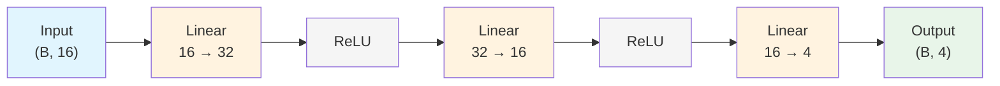
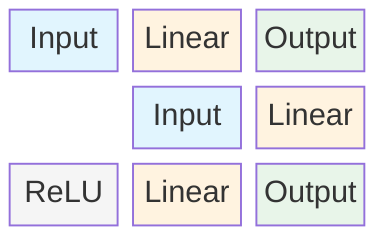
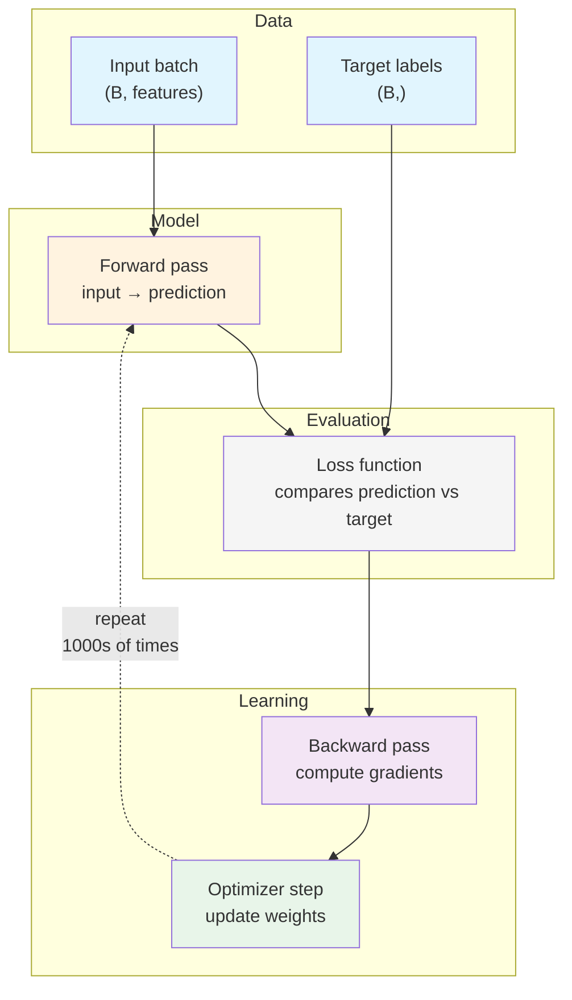
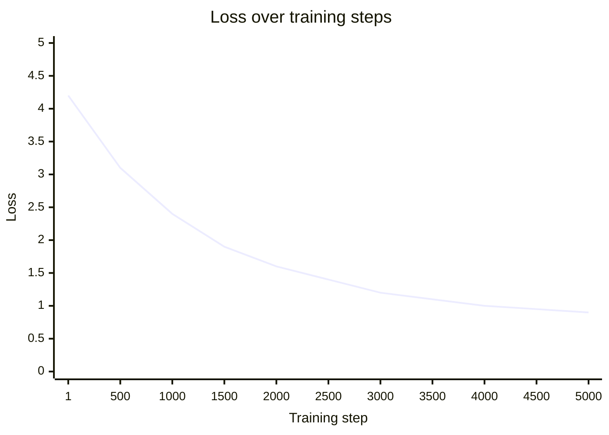
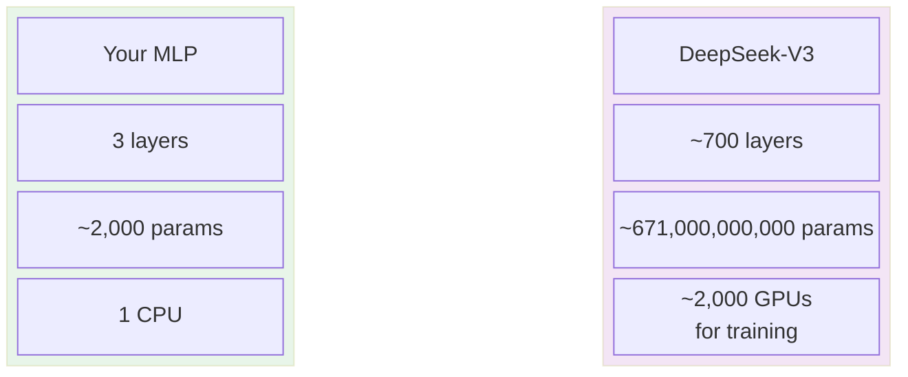

# Chapter 02: Neural Nets & Training

> **Audience**: 🟢 All roles (code sections marked 🔵)
> **Prerequisites**: Chapter 01 (Tensors & Matrix Multiply), basic Python
> **Estimated time**: 20 minutes read, 30 minutes code

---

## Why This Matters

Chapter 01 showed you the **operation** (matrix multiply). Now we organize those operations into a **network** that can learn from data.

This chapter covers the three big ideas:

1. **What a neural network is** — layers stacked with activations
2. **How it learns** — the training loop (forward → loss → backward → step)
3. **What backpropagation actually is** — no calculus, just intuition

---

## Part 1: What Is a Neural Network?

### A Layer Is Just a Matrix Multiply

In code, a single layer looks like this:

```
linear = nn.Linear(in_features=16, out_features=8)
output = linear(input_tensor)
```

And `nn.Linear` does exactly what you learned in Chapter 01:

```
output = input @ weight.T + bias
```

### Stacking Layers



Each layer transforms the representation. Early layers learn simple patterns (edges in images, word types in text). Later layers combine those into complex concepts (objects, sentences, reasoning).

### The Activation Function

Without activations, stacking linear layers is pointless — three linear layers in a row is mathematically equivalent to one. Activations break the linearity:



**Top**: single layer = simple transformation. **Bottom**: with activation between layers = the model can learn complex patterns.

**ReLU** (Rectified Linear Unit) is the simplest: `ReLU(x) = max(0, x)`. It zeroes out negative values, letting the model learn nonlinear relationships.

---

## Part 2: How a Neural Network Learns

### The Training Loop

This is the most important diagram in the entire curriculum:



Let's walk through each step:

#### Step 1: Forward Pass
Data flows through the network. Each layer transforms it. At the end, we get a prediction.

#### Step 2: Loss
We compare the prediction to the correct answer using a **loss function**:
- For classification: **Cross-Entropy Loss** — how wrong is the probability distribution?
- For generation: Same thing, applied to each token prediction.

> 🔎 **What's a probability distribution?** Raw model outputs (logits) are just scores — they can be any number. **Softmax** converts them to proper probabilities: positive numbers that sum to 1. For example, logits `[2.0, -0.5, 0.3]` → softmax → probabilities `[0.68, 0.10, 0.22]`. The model then picks the highest probability or samples from the distribution. This conversion is necessary because the loss function works with probabilities, not raw scores.

Lower loss = better prediction. For our toy problem with a clean separable pattern, the loss can approach 0 — meaning the model classifies every training example correctly. **In real LLM training, loss never reaches 0** — if it did, the model would have memorized (overfit) rather than learning generalizable patterns. A good LLM loss is typically between 2.0 and 4.0 depending on the dataset.

#### Step 3: Backward Pass (Backpropagation)
The loss tells us *how wrong* we are. Backpropagation tells us *which direction to turn each weight* to make it less wrong.

**The key insight**: For every weight in the network, we compute its **gradient** — the direction and magnitude of adjustment that would reduce the loss. This is done by applying the chain rule backwards through the network.

> 🧠 **Intuition without calculus**: Imagine you're adjusting the dials on a giant mixing board to make the output sound better. Backpropagation tells you which dial to turn, how much, and in which direction — instantly, for every dial at once.

#### Step 4: Optimizer Step
We adjust each weight slightly in the opposite direction of its gradient:

```
weight = weight - learning_rate * gradient
```

The **learning rate** controls how big each step is. Too large: you overshoot. Too small: training takes forever.

> 🔵 **Optimizer Note**: This chapter uses **SGD** (Stochastic Gradient Descent) — the simplest optimizer with a single learning rate for all parameters. It's great for learning. Real LLM training uses **AdamW**, which adapts the learning rate per parameter based on gradient history. You'll see AdamW in Phase 1. The training loop structure (forward → loss → backward → step) is identical; only the `optimizer.step()` details change.

### Repeat

Do steps 1–4 thousands of times, and the loss gradually decreases:



The model learns. No magic — just repeated math.

---

## Part 3: From This MLP to an LLM

The model you'll build today:

```
Input (B, 16) → Linear(16→32) → ReLU → Linear(32→16) → ReLU → Linear(16→4) → Output (B, 4)
```

The model that powers ChatGPT:

```
Input (B, 4096) → Embedding(128000→4096) → [Attention → Linear(4096→11008) → SwiGLU → Linear(11008→4096)] × 96 layers → Output (B, 128000)
```

**Same concepts. Just bigger.**



The only new ingredient the LLM adds is **self-attention** — which we cover in Phase 1. Everything else is this chapter scaled up.

---

## 🟢 Quick Summary (For Everyone)

Even if you don't write the code, the training concept is essential for every role:

| Concept | What It Means for Your Job |
|---------|---------------------------|
| **Training** | Model sees data, makes predictions, adjusts weights. Expensive ($M). |
| **Loss** | A single number measuring model quality. You want it to go down. |
| **Data quality matters** | Bad training data → bad model. This is where PMs and BAs contribute. |
| **Evaluation** | You need a separate test set to know if the model actually learned. |
| **Overfitting** | Model memorizes training data but can't generalize to new inputs. This happens when you train too long, the model is too large, or data is scarce. Sign: training loss keeps dropping but test loss starts rising. |

---

## 🔵 For Engineers: Run the Code

Open and run these scripts in order:

```bash
# Step 1: A single linear layer (you already know this)
python code/02-neural-nets/01_linear_layer.py

# Step 2: Build an MLP (multi-layer perceptron)
python code/02-neural-nets/02_mlp.py

# Step 3: The full training loop
python code/02-neural-nets/03_training_loop.py
```

### Exercise

After running the training loop:

1. Try changing `learning_rate` from `0.01` to `0.5` — what happens to the loss?
2. Try removing the ReLU activations — what happens to the final accuracy?
3. Add a fourth layer. Does accuracy improve or plateau?

```python
# Starter template for experiment
# Modify the model in 03_training_loop.py:

class Experiment(nn.Module):
    def __init__(self):
        super().__init__()
        self.net = nn.Sequential(
            nn.Linear(10, 16),
            nn.ReLU(),            # ← Try removing this
            nn.Linear(16, 8),
            nn.ReLU(),            # ← And this
            nn.Linear(8, 3),
        )
```

---

### 🟢 Check Your Understanding

1. **What happens if we set learning_rate too high?** → The optimizer overshoots the minimum and loss diverges or oscillates.
2. **What does ReLU do to negative numbers?** → Sets them to 0. This introduces nonlinearity.
3. **What's the difference between a gradient and a loss?** → Loss measures *how wrong* the prediction is (a single number). Gradient tells each weight *which direction to move* to reduce the loss.
4. **What would happen if we removed all activation functions from the network?** → Two linear layers in sequence collapse to one (A@B = C), so the network can only learn linear patterns.

> Need help? Re-read the "Forward Pass → Loss → Backward → Step" loop section.

---

## Terms Introduced

| Term | Quick Definition |
|------|------------------|
| **Neural Network** | A stack of linear layers with activations between them |
| **Activation Function** | A nonlinear transformation (ReLU, GELU, SwiGLU) |
| **Loss Function** | Measures prediction error (lower = better) |
| **Gradient** | The direction to adjust weights to reduce loss |
| **Backpropagation** | Computing gradients backwards through the network |
| **Optimizer** | The algorithm that updates weights using gradients |
| **Learning Rate** | How big each weight update step is |
| **Epoch** | One full pass over the training data |

---

> **Next Phase**: Phase 1 — The Vanilla Transformer.
>
> *Coming soon: Tokenization, Embeddings, Self-Attention, and building the real thing.*
>
> *🔵 Make sure all three code exercises work before proceeding. You'll build on this foundation.*
